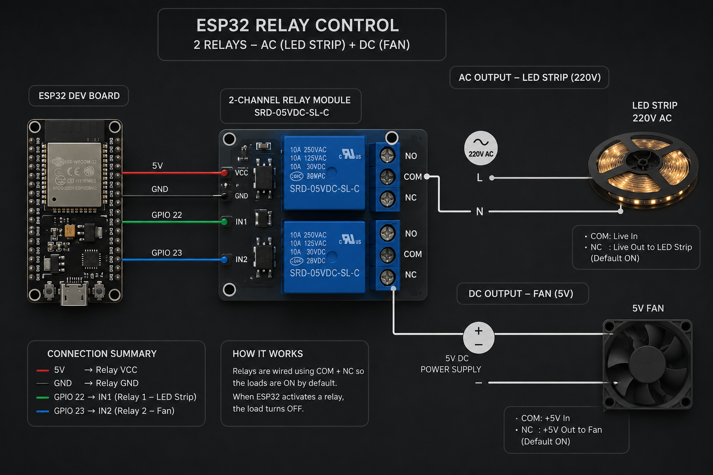

# ESP32 HomeKit Desk Controller

Control your desk light and fan through Apple HomeKit using ESP32 
and the HomeSpan library.

## Video Tutorial
Watch the full tutorial: [رابط الفيديو على يوتيوب]

## Parts List
- ESP32 Dev Board
- 2-Channel 5V Relay Module
- Breadboard
- jumper wire
- usb type c cable

## Setup
1. Install HomeSpan library via Arduino Library Manager
2. Update your Wi-Fi credentials in the code
3. Upload to your ESP32

## Wiring Diagram

